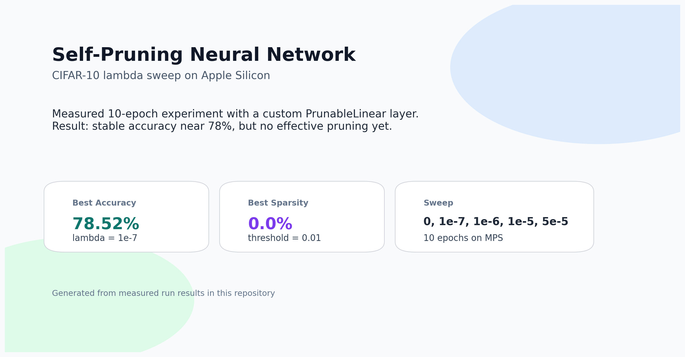
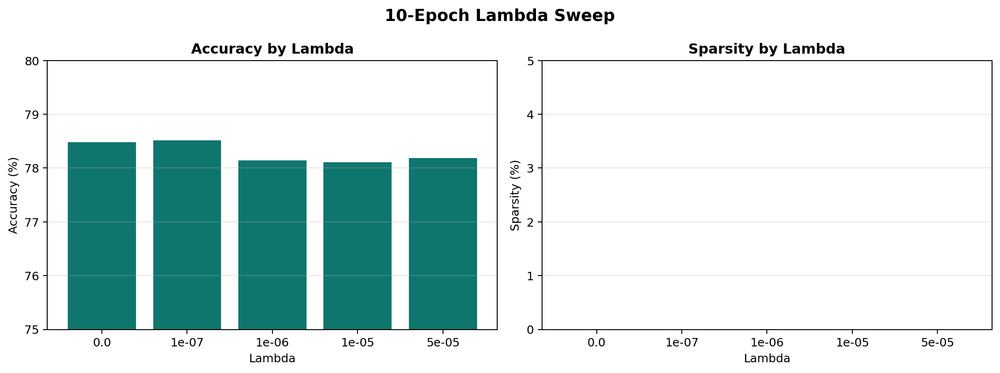
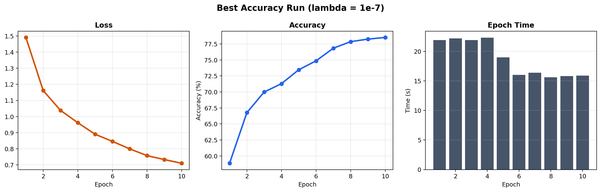

# Self-Pruning Neural Network on CIFAR-10



A compact PyTorch experiment that tests whether a neural network can learn CIFAR-10 classification while simultaneously learning which fully connected weights to suppress through sigmoid gates and an L1-style sparsity objective.

## Highlights

- custom `PrunableLinear` layer with one learnable gate per weight
- CIFAR-10 training on Apple Silicon with `mps`
- measured 10-epoch lambda sweep across `0`, `1e-7`, `1e-6`, `1e-5`, and `5e-5`
- generated report assets, CSV/JSON results, and a PDF summary

## Best Measured Result

- Best accuracy: `78.52%`
- Best lambda: `1e-7`
- Sparsity at threshold `0.01`: `0.0%`

The sweep showed stable classification learning across all tested lambda values, but no effective pruning within 10 epochs. In short: the model learned the task well, but the sparsity penalty was not strong enough, or not trained long enough, to collapse gates toward zero.

## 10-Epoch Lambda Sweep

| Lambda | Test Accuracy | Sparsity Level (%) |
|---|---:|---:|
| `0` | `78.48%` | `0.0%` |
| `1e-7` | `78.52%` | `0.0%` |
| `1e-6` | `78.14%` | `0.0%` |
| `1e-5` | `78.11%` | `0.0%` |
| `5e-5` | `78.19%` | `0.0%` |

## Visual Summary

### Lambda Sweep



### Best Run Overview



## Repository Structure

- `self_pruning_cifar10_mac.py` — main training script
- `REPORT.md` — written analysis of the measured sweep
- `self_pruning_results_report.pdf` — clean PDF version of the report
- `generate_report_assets.py` — regenerates plots and structured results
- `generate_results_pdf.py` — regenerates the PDF summary
- `assets/` — generated figures for the report and README
- `results/` — CSV and JSON outputs from the sweep

## Run Locally

```bash
python3 self_pruning_cifar10_mac.py
python3 generate_report_assets.py
python3 generate_results_pdf.py
```

## Generated Outputs

- `results/lambda_sweep.csv`
- `results/lambda_sweep.json`
- `results/histories_by_lambda.json`
- `assets/cover_image.png`
- `assets/lambda_sweep.png`
- `assets/best_run_overview.png`
- `self_pruning_results_report.pdf`

## Next Step

The natural follow-up experiment is to test stronger sparsity settings such as `1e-4`, `5e-4`, and `1e-3`, or increase training beyond 10 epochs, so the report can demonstrate both good accuracy and real pruning.
